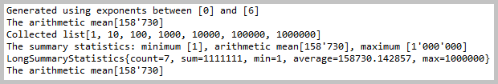

<!DOCTYPE html>
<HTML lang="en">
<META charset="UTF-8">
<BODY>

<H2 id="contents">Study19 README Contents</H2>
<H3 id="top">Research mathematics and statistics</H3>

The sections of this project:

<ol>
<li><a href="#ONE">Compact Number Format</A></li>
<li><a href="#TWO">Remapping Functions With Logical Operators</A></li>
<li><a href="#THREE">Even &amp; Odd Numbers</A></li>
<li><a href="#FOUR"><i>Golden Ratio</i></A></li>
<li><a href="#FIVE"><i>Fibonacci</i> Numbers</A></li>
<li><a href="#SIX">Least Common Multiple</A></li>
<li><a href="#SEVEN">Cubes &amp; Roots</A></li>
<li><a href="#EIGHT">Big Decimals Multiplication</A></li>
<li><a href="#NINE">Big Integer Raising</A></li>
<li><a href="#TEN">Big Integer Randomly Generating</A></li>
<li><a href="#ELEVEN">Clamp Numbers & Compare Big Decimals</A></li>
<li><a href="#TWELVE">Means: Harmonic, Geometric, Arithmetic, Quadratic</A></li>
<li><a href="#THIRTEEN">Summary Statistics</A></li>
<li><a href="#FOURTEEN"><i>Bayes' Theorem</i>: Randomized Trials Launcher</A></li>
<li><a href="#FIFTEEN"><i>Bayes' Theorem</i>: Statistical Measures</A></li>
</ol>

Java source code: 
 
 package 
	<a href="https://github.com/k1729p/Study19/tree/master/src/main/java/kp/">kp</a> 

 

    <a href="http://htmlpreview.github.io/?https://github.com/k1729p/Study19/blob/main/docs/apidocs/index.html">
	Java API Documentation</a> 

Action: 
 
 1. With the batch file 
<a href="https://github.com/k1729p/Study19/blob/main/0_batch/01%20MVN%20clean%20install%20%2B%20Run%20Application.bat">
'01 MVN clean install + Run Application.bat'</a> launch the 
<a href="https://github.com/k1729p/Study19/blob/main/src/main/java/kp/Application.java">'Application'</a>. 

<a href="#top">Back to the top of the page</a>

1. The compact number format. The method 
<a href="https://github.com/k1729p/Study19/blob/main/src/main/java/kp/math/NumberInCompactForm.java#L30">
'kp.math.NumberInCompactForm::format'</a>.

 

<I>Console log from 'NumberInCompactForm::format' method.</I>

<a href="#top">Back to the top of the page</a>

2. The remapping functions with logical operators. The method 
<a href="https://github.com/k1729p/Study19/blob/main/src/main/java/kp/math/Logic.java#L26">
'kp.math.Logic::mergeMap'</a>.

 

<I>Console log from 'Logic::mergeMap' method.</I>

<a href="#top">Back to the top of the page</a>

3. Segregating with the method 'Collectors::partitioningBy'. 
The method 
<a href="https://github.com/k1729p/Study19/blob/main/src/main/java/kp/math/EvenAndOddNumbers.java#L28">
'kp.math.EvenAndOddNumbers::segregate'</a>.

 

<I>Console log from 'EvenAndOddNumbers::segregate' method.</I>

<a href="#top">Back to the top of the page</a>

4. Computing the golden ratio with different scales. The method 
<a href="https://github.com/k1729p/Study19/blob/main/src/main/java/kp/math/GoldenRatio.java#L45">
'kp.math.GoldenRatio::compute'</a>.

 

<I>Console log from 'GoldenRatio::compute' method.</I>

<a href="#top">Back to the top of the page</a>

5. Computing the Fibonacci numbers with different algorithms. 
The method 
<a href="https://github.com/k1729p/Study19/blob/main/src/main/java/kp/math/FibonacciNumbers.java#L38">
'kp.math.FibonacciNumbers::compute'</a>.

 

<I>Console log from 'FibonacciNumbers::compute' method.</I>

<a href="#top">Back to the top of the page</a>

6. Computing the least common multiple. The method 
<a href="https://github.com/k1729p/Study19/blob/main/src/main/java/kp/math/LeastCommonMultiple.java#L30">
'kp.math.LeastCommonMultiple::compute'</a>.

 

<I>Console log from 'LeastCommonMultiple::compute' method.</I>

<a href="#top">Back to the top of the page</a>

7. Computing the cubes and the roots. 
 
The method 
<a href="https://github.com/k1729p/Study19/blob/main/src/main/java/kp/math/CubesAndRoots.java#L29">
'kp.math.CubesAndRoots::compute'</a>.

 

<I>Console log from 'CubesAndRoots::compute' method.</I>

<a href="#top">Back to the top of the page</a>

8. Multiplicating the 'BigDecimal'. The method 
<a href="https://github.com/k1729p/Study19/blob/main/src/main/java/kp/math/BigDecimalsFromStringRepresentation.java#L33">
'kp.math.BigDecimalsFromStringRepresentation::multiply'</a>.

 

<I>Console log from 'BigDecimalsFromStringRepresentation::multiply' method.</I>

<a href="#top">Back to the top of the page</a>

9. Raising the 'BigInteger' with the specified value to the specified exponent value. 
The method 
<a href="https://github.com/k1729p/Study19/blob/main/src/main/java/kp/math/VeryBigIntegerRaised.java#L53">
'kp.math.VeryBigIntegerRaised::compute'</a>.

The <a href="images/VeryBigIntegerRaisedCompute.png">screenshot</a> 
of the console log from 'VeryBigIntegerRaised::compute' method.

<a href="#top">Back to the top of the page</a>

10. Generating the 'BigInteger' with the 'SecureRandom'. 
The method 
<a href="https://github.com/k1729p/Study19/blob/main/src/main/java/kp/math/VeryBigIntegerRandomlyGenerated.java#L33">
'kp.math.VeryBigIntegerRandomlyGenerated::compute'</a>.

 

<I>Console log from 'VeryBigIntegerRandomlyGenerated::compute' method.</I>

<a href="#top">Back to the top of the page</a>

11. Clamping the numbers and comparing the BigDecimal numbers.

 The method
<a href="https://github.com/k1729p/Study19/blob/main/src/main/java/kp/math/ClampNumbersAndCompareBigDecimals.java#L32">
'kp.math.ClampNumbersAndCompareBigDecimals::clampNumbers'</a>.

 

<I>Console log from 'ClampNumbersAndCompareBigDecimals::clampNumbers' method.</I>

 The method
<a href="https://github.com/k1729p/Study19/blob/main/src/main/java/kp/math/ClampNumbersAndCompareBigDecimals.java#L59">
'kp.math.ClampNumbersAndCompareBigDecimals::compareBigDecimals'</a>.

 

<I>Console log from 'ClampNumbersAndCompareBigDecimals::compareBigDecimals' method.</I>

<a href="#top">Back to the top of the page</a>

12. Computing the means with the method 'Collectors::teeing'. 
The method 
<a href="https://github.com/k1729p/Study19/blob/main/src/main/java/kp/math/means/Means.java#L35">
'kp.math.means.Means::computeMeansWithTeeing'</a>.

 

<I>Console log from 'Means::computeMeansWithTeeing' method.</I>

<a href="#top">Back to the top of the page</a>

13. Computing the average with the method 'LongStream::average' and 
the 'LongSummaryStatistics' with the method 'LongStream::summaryStatistics'. 
The method 
<a href="https://github.com/k1729p/Study19/blob/main/src/main/java/kp/math/means/SummaryStatistics.java#L32">
'kp.math.means.SummaryStatistics::show'</a>.

 

<I>Console log from 'SummaryStatistics::show' method.</I>

<a href="#top">Back to the top of the page</a>

14. Launching the series of randomized trials. 
The method 
<a href="https://github.com/k1729p/Study19/blob/main/src/main/java/kp/math/means/bayes/RandomizedTrialsLauncher.java#L48">
'kp.math.means.bayes.RandomizedTrialsLauncher::launchSeriesOfTrials'</a>.

<table style="border:solid">
<tbody>
<tr><td style="border:solid">
<table style="border:solid">
<tbody>
<tr><td style="border:solid">TN</td><td style="border:solid">True Negative</td></tr>
<tr><td style="border:solid">TP</td><td style="border:solid">True Positive</td></tr>
<tr><td style="border:solid">PG</td><td style="border:solid">Positive Genuine</td></tr>
<tr><td style="border:solid">PR</td><td style="border:solid">Positive Received</td></tr>
<tr><td style="border:solid">TPR</td><td style="border:solid">True Positive Rate (Sensitivity)</td></tr>
<tr><td style="border:solid">PPV</td><td style="border:solid">Positive Predictive Value (Precision)</td></tr>
</tbody></table>
</td><td style="border:solid">
<table style="border:solid">
<tbody>
<tr><td style="border:solid">FN</td><td style="border:solid">False Negative</td></tr>
<tr><td style="border:solid">FP</td><td style="border:solid">False Positive</td></tr>
<tr><td style="border:solid">NG</td><td style="border:solid">Negative Genuine</td></tr>
<tr><td style="border:solid">NR</td><td style="border:solid">Negative Received</td></tr>
<tr><td style="border:solid">TNR</td><td style="border:solid">True Negative Rate (Specificity)</td></tr>
<tr><td style="border:solid">NPV</td><td style="border:solid">Negative Predictive Value</td></tr>
</tbody></table>
</td></tr>
</tbody></table>

 

<I>Console log from 'RandomizedTrialsLauncher::launchSeriesOfTrials' method.</I>

<a href="#top">Back to the top of the page</a>

15. Measuring the samples for the Bayes Formula. 
The method 
<a href="https://github.com/k1729p/Study19/blob/main/src/main/java/kp/math/means/bayes/StatisticalMeasures.java#L27">
'kp.math.means.bayes.StatisticalMeasures::measureSamples'</a>.

The <a href="images/StatisticalMeasuresMeasureSamples.png">screenshot</a> 
of the console log from 'StatisticalMeasures::measureSamples' method.

<a href="#top">Back to the top of the page</a>

</BODY>
</HTML>